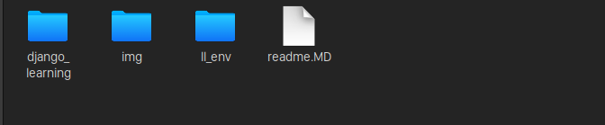

# Here some notes for my Django learning project. (Chinese & English version)

## 1. Create virtual environment
switch to the file where you will create the virtual environment, use python3
```
virtualenv ll-env
```
_ll-env is the name of this environment, you can name this environment with other names_


## 2. Activate virtual environment
```
source ll_env/bin/activate
```
(_deactivate the environment you can use command like this:_ )
```
deactivate
```
**NOTES**
'bin/' file is the binary folder for execute files of almost all the software and program.

## 3. Install Django

Here we install Django 1.11 version or 2.2. Because these versions' lifecycle is longer than other versions. In this case you can gain more technical supports from the official. And the version wouldn't be outdated very soon.
```
pip install Django==2.2
```


## 4. Create a new subject in Django
type below commands in the virtual environment:
```
django-admin.py startproject django_learning
```
___'django_learning' is the projects name. This file is the located where the webiste/app will be___


## 5. Create database
in the development we use SQLite as the datadase. But it not means we will use this type of database in the production version. We will change it later. But now we use it because it is convenient and sample.
__Switch to the file of 'django_learning', type command as below:__

```
$ python manage.py migrate
```
After this step,  Django would create a new data fils named 'db.sqlite3'


## 6. Check this project
To here, we type as below command, then open the website to check if the configuraton is successful.
```
$ python manage.py runserver
```
If the webpage page shown contents like below picture(or similar). It means we are successful!

_ _ _

